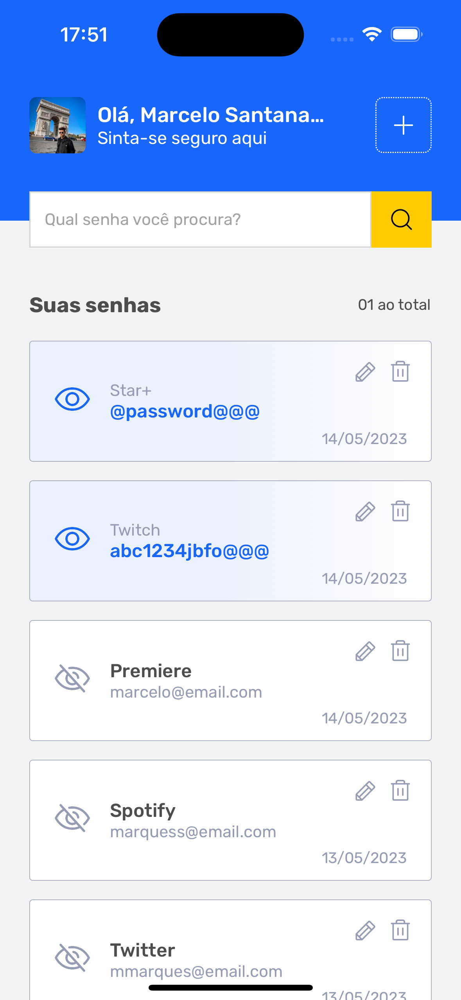
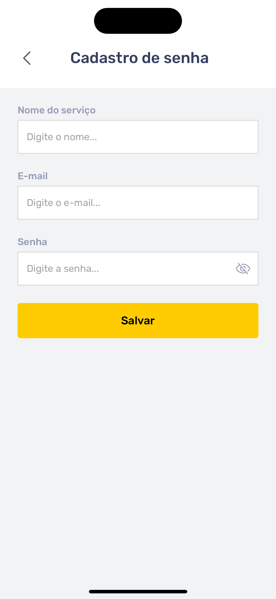
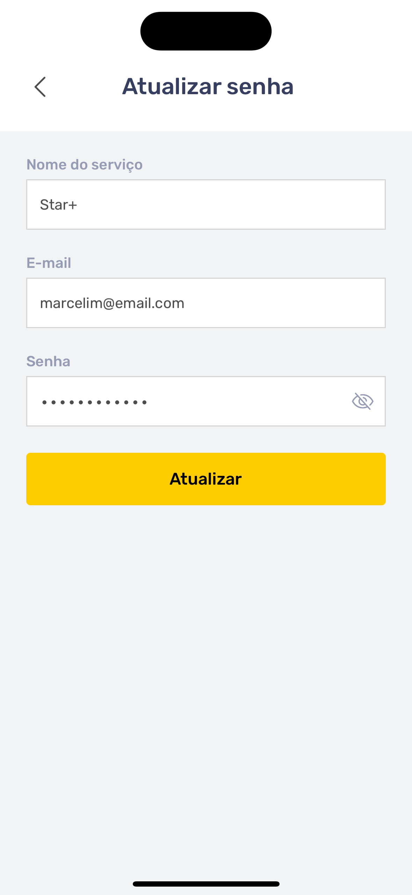

<h1 style="text-align: center; font-weight: bold;">Savepass App</h1>

## Sobre o Projeto

Este projeto consistem em um app para cadastrar e organizar suas senhas em qualquer plataforma.

### Tecnologias Usadas

- [React Native](https://reactnative.dev/)
- [Expo](https://expo.dev/)
- [TypeScript](https://www.typescriptlang.org/)
- [Styled Components](https://styled-components.com/)
- [Native Base](https://nativebase.io/)
- [React Router](https://reactrouter.com/en/main)
- [React Hook Form](https://react-hook-form.com/)

### Como rodar a aplicação

```bash
# Clone este repositório
$ git clone https://github.com/marrcelosantana/save-pass-app
# Acesse a pasta do projeto
$ cd save-pass-app
# Instale as dependências
$ npm install
# Execute a aplicação em modo de desenvolvimento
$ expo start

```

### Imagens

|                 Login                 |                Dashboard                 |
| :-----------------------------------: | :--------------------------------------: |
|  |  |

|                 Register                 |                Update                 |
| :--------------------------------------: | :-----------------------------------: |
|  |  |
